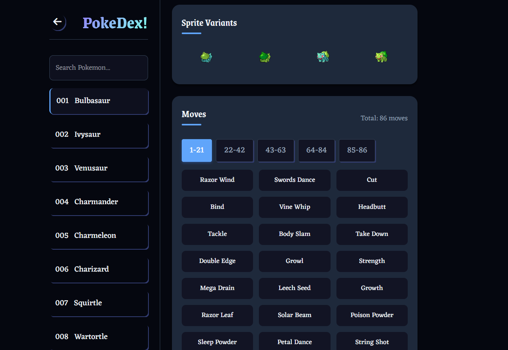

# PokeDex

PokeDex is a modern, React-based application built with [Vite](https://vitejs.dev/) that allows you to explore the original 151 Pokémon. It leverages data from the [PokéAPI](https://pokeapi.co/) to display detailed Pokémon information such as stats, types, abilities, moves, and sprites. With a responsive layout and light/dark theme support, PokeDex delivers an interactive user experience across desktop and mobile devices.

---

## Table of Contents

1. [Features](#features)
2. [Project Structure](#project-structure)
3. [Installation](#installation)
4. [Usage](#usage)
5. [Screenshots](#screenshots)
6. [Technologies Used](#technologies-used)
7. [Contributing](#contributing)
8. [License](#license)
9. [Acknowledgments](#acknowledgments)

---

## Features

- **Pokémon Browsing**: View the first 151 Pokémon with name, number, stats, types, abilities, and moves.
- **Responsive UI**: Optimized layout for both mobile and desktop.
- **Interactive Moves Modal**: Click on a move to see additional details in a modal overlay.
- **Search Functionality**: Quickly filter Pokémon by name or Pokédex number.
- **Local Caching**: Uses `localStorage` to cache Pokémon and move data for improved performance.
- **Light/Dark Theme**: Toggle between light and dark themes seamlessly.(Not Completed yet!)

---

## Project Structure

A snapshot of the project structure is as follows:

```
POKEDEX
├─ Images
│   └─ ... (Additional images or assets)
├─ node_modules
├─ public
│   ├─ pokemon
│   │   └─ ... (PNG or SVG files for Pokémon sprites)
│   └─ vite.svg
├─ src
│   ├─ assets
│   ├─ components
│   │   ├─ Header.jsx
│   │   ├─ Modal.jsx
│   │   ├─ PokeCard.jsx
│   │   ├─ SideNav.jsx
│   │   ├─ ThemeToggle.jsx
│   │   └─ TypeCard.jsx
│   ├─ utils
│   ├─ App.jsx
│   ├─ fanta.css
│   ├─ index.css
│   └─ main.jsx
├─ .gitignore
├─ eslint.config.js
├─ index.html
├─ package-lock.json
├─ package.json
├─ README.md
└─ vite.config.js
```

### Key Files

- **index.html**: The main HTML file used by Vite.
- **main.jsx**: The root entry point that renders the React `<App />` component into the DOM.
- **App.jsx**: The main application layout combining header, sidebar navigation, and the Pokémon detail view.
- **components/**: Contains individual React components:
  - **Header.jsx**: Displays the top navigation bar in mobile view.
  - **SideNav.jsx**: Shows a searchable list of Pokémon (sidebar navigation).
  - **PokeCard.jsx**: Fetches and displays detailed information for the selected Pokémon (stats, moves, sprites, etc.).
  - **Modal.jsx**: Renders modal overlays (e.g., for move details).
  - **ThemeToggle.jsx**: Provides a button to toggle between light and dark themes.
  - **TypeCard.jsx**: Renders a Pokémon type tile with dynamic coloring.
- **utils/**: Contains helper functions for formatting Pokédex numbers, filtering data, etc.
- **fanta.css & index.css**: Global and layout-specific styles. Provide typography, colors, transitions, and responsive design.
- **public/pokemon/**: Houses images or sprites used in the application.

---

## Installation

1. **Clone the Repository**:

   ```bash
   git clone https://github.com/Arbiter09/React-PokeDex.git
   cd pokedex
   ```

2. **Install Dependencies**:

   ```bash
   npm install
   ```

3. **Run Development Server**:

   ```bash
   npm run dev
   ```

   Vite will start the development server. Open the URL shown in your terminal (e.g., `http://localhost:5173`) to access the app.

4. **Build for Production** (optional):

   ```bash
   npm run build
   ```

   This will create an optimized production build in the `dist` folder.

---

## Usage

- **Sidebar Navigation**: On larger screens, the sidebar is always visible on the left. On smaller screens, toggle it with the top-left menu icon.
- **Search**: Enter a Pokémon name or Pokédex number to filter the list.
- **Select a Pokémon**: Click on a Pokémon in the list to load its detailed view.
- **View Moves**: Scroll through the moves section and click any move to see additional details in a modal.
- **Sprites**: Explore various sprite variants (front, back, shiny, etc.).
- **Theme Toggle**: Use the toggle (if provided via `ThemeToggle.jsx`) to switch between light and dark mode.(Not Completed yet!)

---

## Screenshots

Here are some screenshots illustrating the functionality. (Make sure these images exist in your repository, typically within an `Images` folder or `public` folder.)

### Dashboard View


### Mobile Dashboard


### Mobile Navigation


### Move Info Modal Overlay


### Sprite Moves



### Search Functionality


_(Adjust the paths if your images are located in a different directory.)_

---

## Technologies Used

- **React**: JavaScript library for building user interfaces.
- **Vite**: Modern frontend build tool for faster development.
- **PokéAPI**: Provides Pokémon data via [PokéAPI](https://pokeapi.co/).
- **CSS**: Responsive design using custom CSS files (`fanta.css` and `index.css`).
- **ESLint**: For linting and maintaining code quality.

---

## Contributing

Contributions are welcome! Feel free to fork this repository, create a new branch, and open a pull request with your changes.

1. Fork the project.
2. Create a new branch: `git checkout -b feature/YourFeature`
3. Commit your changes: `git commit -m 'Add your feature'`
4. Push to the branch: `git push origin feature/YourFeature`
5. Open a Pull Request.

---

## License

This project is open source and available under the [MIT License](LICENSE). Feel free to modify and distribute as you see fit.

---

## Acknowledgments

- [PokéAPI](https://pokeapi.co/) for providing the Pokémon data.
- Pokémon community for their support and resources.
- All contributors who have helped improve this project.

---

**Happy Coding!** If you have any questions or issues, please open an [issue](https://github.com/your-username/pokedex/issues) or reach out. Enjoy exploring the world of Pokémon!
